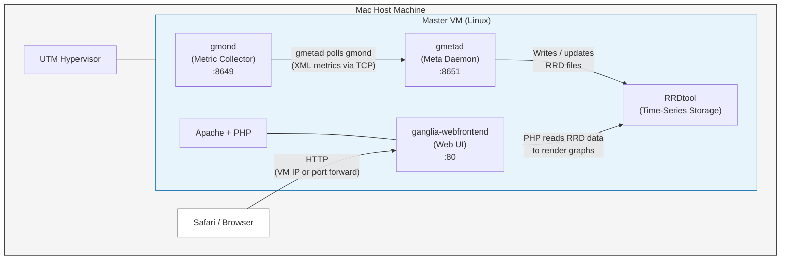
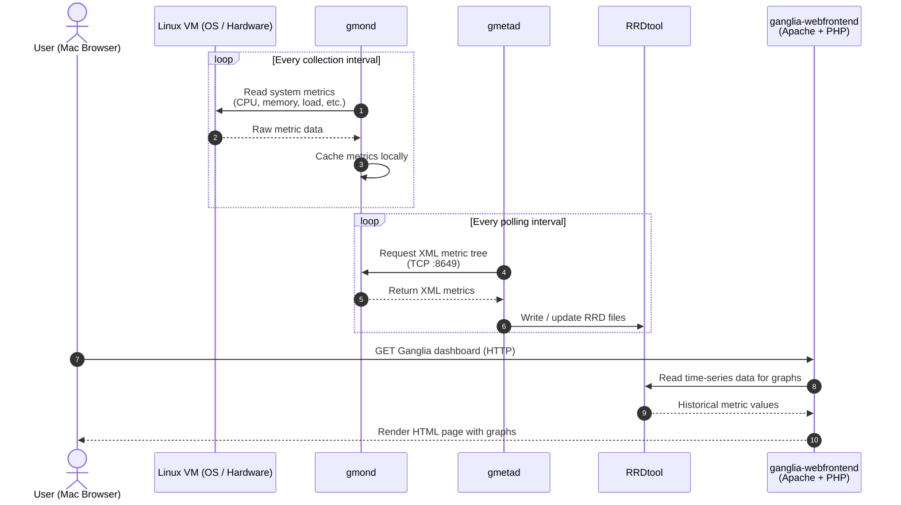

# Ganglia System Architecture

## gmond
## gmetad
## ganglia webfront

## node_exporter
## pramentheus
## grafana

Single-node Ganglia monitoring setup: one Linux VM (master) running inside UTM on a Mac host. All Ganglia components run on the same VM; the web UI is accessed from the Mac browser.

---

## Deployment Diagram

### Deployment notes

| Item | Value |
|------|-------|
| Host | Mac |
| Hypervisor | UTM |
| VMs | 1 (master only — no separate worker nodes) |
| Master VM components | gmond, gmetad, RRDtool, Apache, ganglia-webfrontend |
| Cluster | Single cluster, single node |

---

## Sequence Diagram — Metric Collection to Dashboard

Typical flow: gmond collects host metrics, gmetad polls and stores them in RRD, and the web frontend reads RRD when you open the dashboard in your browser.

### Sequence notes

1. **gmond** runs continuously on the master VM and collects metrics from the local OS.
2. **gmetad** polls **gmond** on the same machine (standard single-node setup) and persists data via **RRDtool**.
3. **ganglia-webfrontend** uses PHP to read RRD files and serve graphs when you open the UI from your Mac.

4. State Machine Transition Diagram (UML State Machine)

Why it fits: Since you are verifying your findings by running benchmarking programs to compare both tools, you need to show how the system updates a node's state. Ganglia relies on age counters ($tn$, $tmax$, $dmax$). If a worker is under heavy load or drops packets, it transitions from Active to Stale to Dead.

What it exposes for your documentation: It documents how Ganglia handles failures under pressure—by passively dropping nodes out of the XML grid when thresholds breach, rather than actively retrying connections like Prometheus does.

