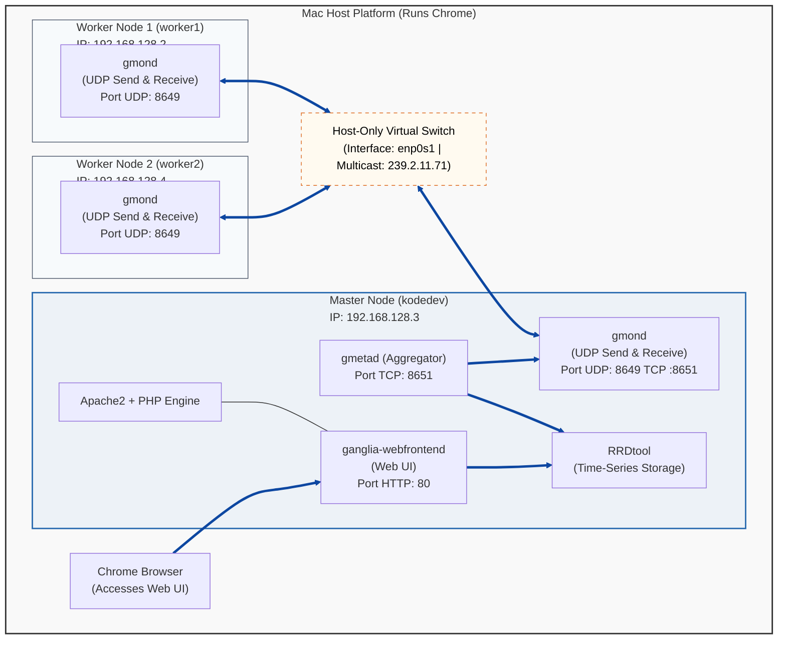
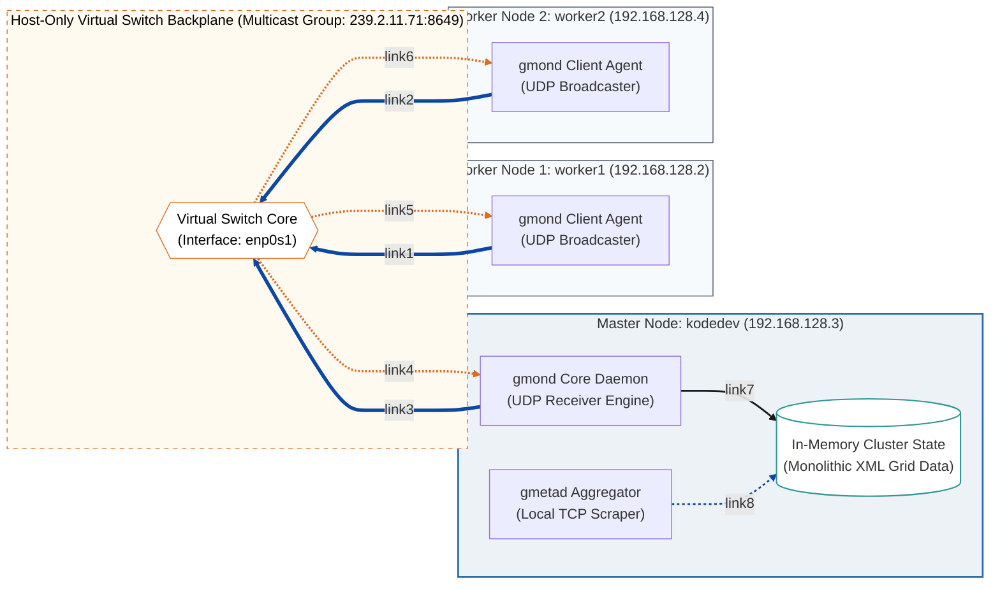
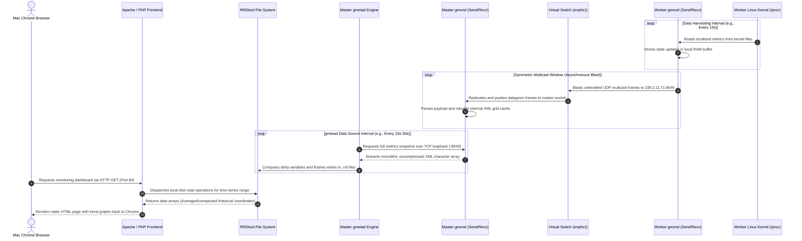
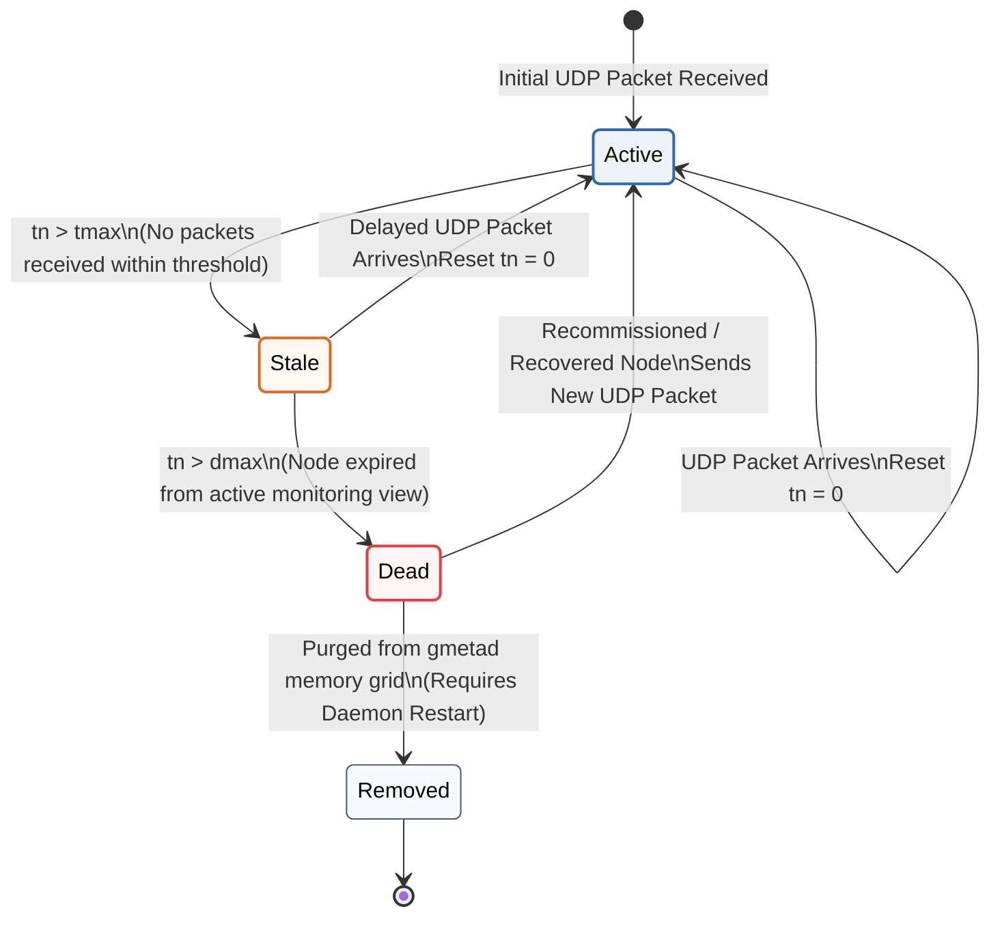
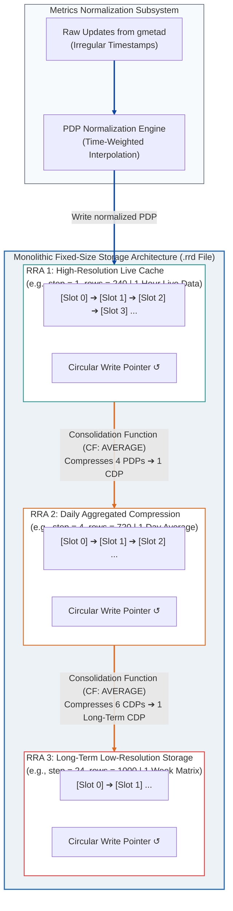

# 3-Node Ganglia Cluster Architecture & Bottleneck Analysis

1.How local sandbox 3 vm are configured?

2.how its configured together?
## gmond
## gmetad
## ganglia webfront

3.how its configured together?
## node_exporter
## pramentheus
## grafana

'
This technical document details the system design, deployment layout, and runtime communication pathways of our 3-node self-study monitoring cluster. This configuration serves as the performance baseline for quantifying the resolution and scaling gaps when migrating workloads from legacy push architectures to modern scraping engines.

---

## 1. System Topology & Deployment Diagram

The diagram below illustrates how the physical Mac Host machine runs three distinct Linux Virtual Machines inside the hypervisor layer, bound together by a virtual Host-Only network switch (`enp0s1`). In this symmetric multicast configuration, every `gmond` daemon across all nodes executes both UDP send and receive channels to share state. 

*Note: Mermaid connection lines and arrowheads have been explicitly styled with a thick, high-contrast dark blue stroke (`#0d47a1`) to maximize legibility against both light and dark markdown themes.*

### 2. Multicast Traffic & Processing Flow (Network Graph / Bottleneck View)

The graph below visualizes the runtime data-blast problem inherent in Ganglia's symmetric multicast configuration. Both compute workers and the master continuously push metric packages onto the host-only switch (`enp0s1`), forcing every individual node to listen to and process every packet traversing the channel.

Architectural Highlights Exposed in this Diagram:The $O(N^2)$ Multicast Storm Target: Lines 4, 5, and 6 show the replication cost. Because every node runs a symmetric gmond instance configured to listen on the identical port, the virtual switch core must copy and blast every single incoming UDP frame back to all cluster members. As you scale past 3 nodes, this background chatter consumes significant networking packet buffer depth.The CPU Serialization Penalty: Line 7 demonstrates the internal ingestion wall. The master gmond container is forced to continuously parse stateless UDP payloads, compute the running delta timer ($tn$), and maintain a large structural monolithic in-memory XML snapshot layout.The Local Loopback Scraping Contention: Line 8 points out that gmetad hits this exact data array periodically over local TCP sockets. This creates a severe compute lock on the master VM when large tracking workloads cause rapid metric metric state changes.

### 3. Asynchronous Data Collection Lifecycle (UML Sequence)

This sequence diagram maps the temporal gaps and decoupled intervals inherent in Ganglia's data gathering lifecycle. It explicitly documents how data ages as it moves from the compute worker kernels up to your Mac's browser.

### 4. State Machine Transition Diagram (UML State Machine)

This state machine diagram documents how Ganglia tracks cluster membership and node health under high-stress benchmarking conditions. It tracks how a node transitions through states passively based entirely on elapsed time counters, rather than active connection checks.

### 5.Math behind the databse compression.
 
The RRDtool Mathematical Aggregation & Compression EquationsTo enforce a fixed footprint on disk, Ganglia uses RRDtool's two-stage normalization and data consolidation architecture. This math explains the resolution bottleneck: micro-spikes are averaged out to maintain constant file size.Stage 1: Primary Data Point (PDP) NormalizationWhen gmetad pushes raw metrics into RRDtool, they rarely land precisely on an exact clock step interval boundary. RRDtool computes a time-weighted average to align incoming readings into a standard Primary Data Point (PDP):$$PDP = \frac{\sum_{i=1}^{n} V_i \cdot \Delta t_i}{\sum_{i=1}^{n} \Delta t_i}$$Where:$V_i$ is the value of the raw parsed metric at update time $t_i$.$\Delta t_i$ is the time delta spent within the current step window.Stage 2: Consolidated Data Point (CDP) CompressionTo store data over long windows (days, weeks, or years), a configured number of consecutive PDPs are compressed into a single Consolidated Data Point (CDP) using a Consolidation Function ($CF$), such as AVERAGE:$$CDP_{AVERAGE} = \frac{1}{N_{steps}} \sum_{j=1}^{N_{steps}} PDP_j$$Where:$N_{steps}$ is the consolidation step ratio defined in the Round Robin Archive (RRA).Stage 3: The Xfiles Factor ($XFF$) ConditionIf a node drops packets under stress, a PDP can evaluate to UNKNOWN. RRDtool determines if the compressed CDP remains valid or gets thrown out entirely using the Xfiles Factor ($XFF$) formula:$$CDP = \begin{cases} CF(PDP_1, \dots, PDP_N), & \text{if } \frac{N_{UNKNOWN}}{N_{steps}} \le XFF \\ UNKNOWN, & \text{if } \frac{N_{UNKNOWN}}{N_{steps}} > XFF \end{cases}$$The Bottleneck Implication: In Ganglia's default configuration, $XFF = 0.5$. If your compute workload stresses a worker node such that more than 50% of its UDP packets are dropped during a consolidation window, the entire historical slot becomes empty (NaN), completely erasing critical benchmarking stress peaks.2. RRDtool Circular Database System DiagramThe diagram below details the internal structure of an active .rrd file on kodedev. It illustrates how the ingestion pipeline strips raw resolution step-by-step into fixed-size circular archives.

1. The Wire Overhead: Text vs. XML Parse Burden
When gmetad connects to a gmond instance over TCP, it receives the entire state of the cluster or node wrapped in highly verbose, deeply nested XML tags.

Ganglia XML Wire Payload Example:
XML
<CLUSTER NAME="self-study-cluster" LOCALTIME="1718645000">
  <HOST NAME="worker1" IP="192.168.128.2" REPORTED="1718644995">
    <METRIC NAME="cpu_user" VAL="42.5" TYPE="float" UNITS="%" NAME="CPU User"/>
    <METRIC NAME="mem_free" VAL="2048aa" TYPE="float" UNITS="KB" NAME="Free Memory"/>
  </HOST>
</CLUSTER>
The Problem: To read this, the Master VM's CPU must initialize an XML DOM or SAX parser, allocate memory structures for every single tag layer, iterate through the string elements, and cast text values back to numbers. Under heavy benchmarking, this serialization loop blocks the main thread.

Prometheus Plain-Text Payload Example:
Plaintext
node_cpu_seconds_total{cpu="0",mode="user"} 1420.5
node_memory_MemFree_bytes 2097152000
The Fix: Prometheus endpoints export raw, flat text using standard line-separated values. Parsing this on the Master VM requires no complex tree validation or schema mapping. The server reads the stream sequentially, splits lines by whitespace, and dumps the raw bits directly into its index. The computational cost drops by orders of magnitude.

